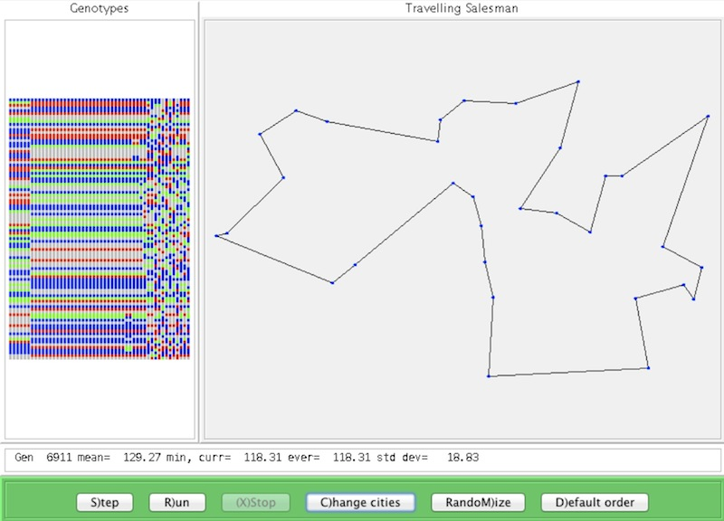

Salesman
===========

Salesman uses a genetic algorithm to solve the travelling salesman problem:
given a set of cities, a salesman must choose a route that visits each city once before returning
to the starting city, and minimize the distance travelled.
It is implemented here as an Eclipse Java project.

Each possible sequence of cities is called a 'member' of the population.
Starting with a population of random members (i.e., random permutations of city indices),
the population is modified by using the standard techniques of genetic algorithms (mutation and crossover) to find a good solution.

Loading the page "Applet.html" within a browser should (maybe) start the program.
Failing that, from a command line you can try "appletviewer Applet.html".

